## Image Morphing with Delaunay Triangulation

CS/EE 166 Final Project

[Eric Lee](https://www.ericchanlee.com/), Caltech CS

---

# Delaunay Triangulation

---

## Naive Cross Fade

<div class="container">

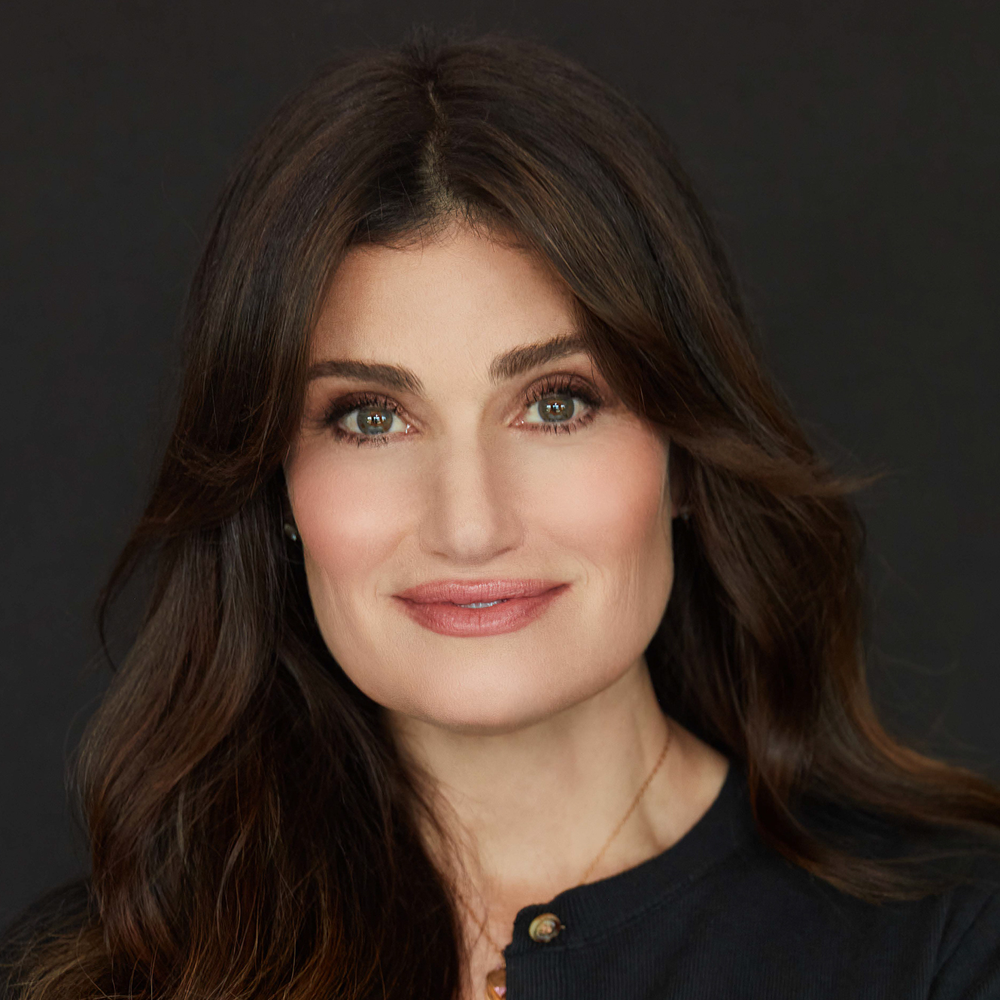


</div>

<!--
Explain actors
Goal: Do better than this
-->

---

## Triangulation

<div class="container">

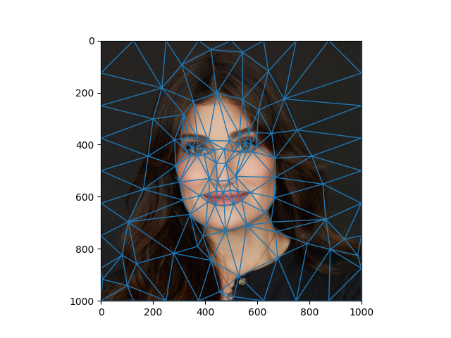
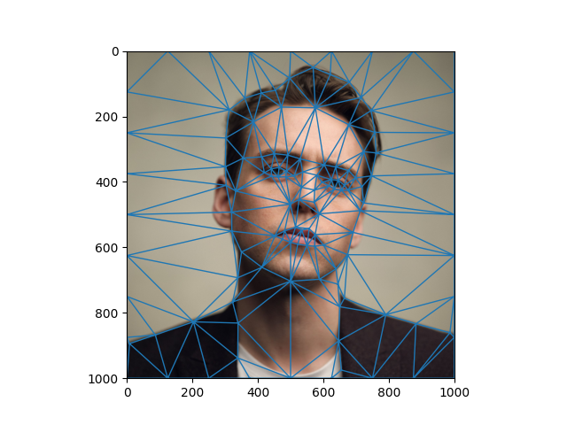

</div>

<!--
Avoids having to select triangles, just lets you pick points
So how do we triangulate?
-->

---

## Delaunay Triangulation

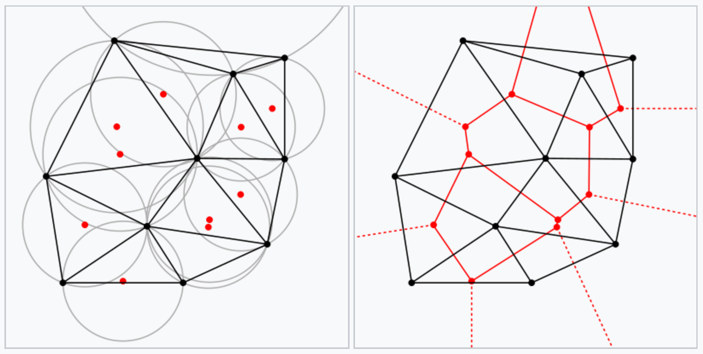

Convex Hull division

<!--
Takes plane, subdivides their convex hull into triangles whose
circumcircles do not contain any of the verticies.
This maximizes the size of the smallest angle in any of the triangles.
Useful to avoid sliver simplexs (sharp triangles)

Dual to Voronoi Diagram.

Iterative algorithm described in original paper. Bowyer–Watson algorithm
Convex Hull Optimization tools exist though.

[Previous slide to show how nice everything looks]

But triangles don't correspond
-->


---

## Average Mesh

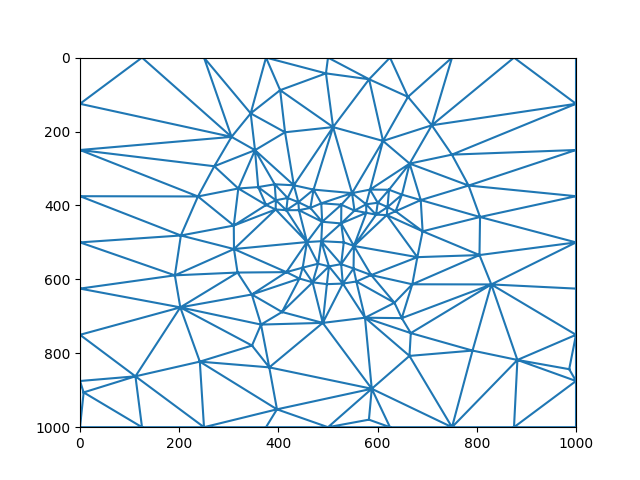

<!--
We triangulate the average of the points and map those same triangles back
-->

---

## Remap Average Mesh

<div class="container">

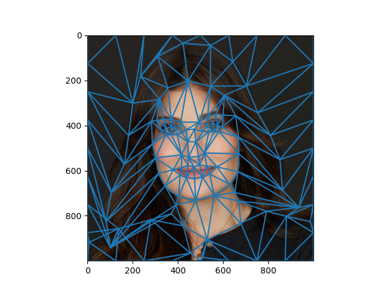
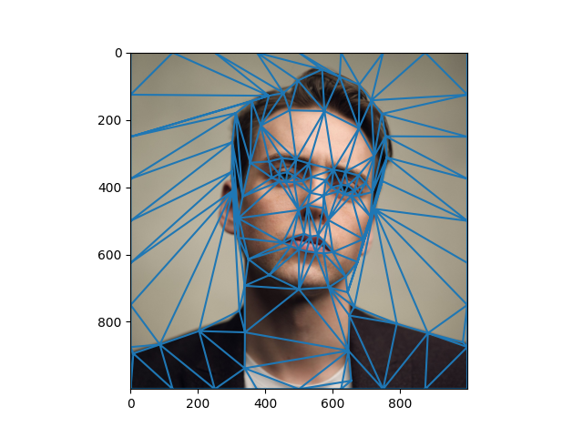

</div>

<!--
Observe "Pull" of triangles is visible and clear
-->

---

# Image Morphing

---

## Simplex Mapping

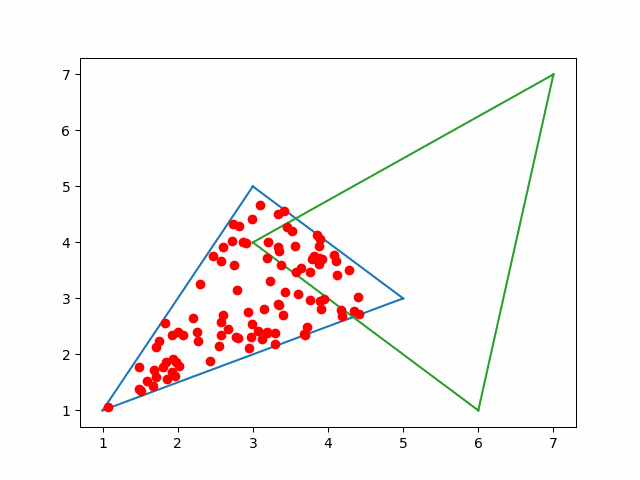

<!--
Linear Map
Triangle is 2D but transformation is affine linear in 2D so 3D matrix is required
-->

---

## Simplex Mapping

$$
\begin{pmatrix}
    x_1' & x_2' & x_3' \\\\
    y_1' & y_2' & y_3' \\\\
    1 & 1 & 1
\end{pmatrix}
\begin{pmatrix}
    x_1 & x_2 & x_3 \\\\
    y_1 & y_2 & y_3 \\\\
    1 & 1 & 1
\end{pmatrix}^{-1}
$$

Transforming $T$ to $T'$

<!--
Trick: Treat each vertex as extra z = 1
Change of basis
-->

---

## Simplex Mapping Example

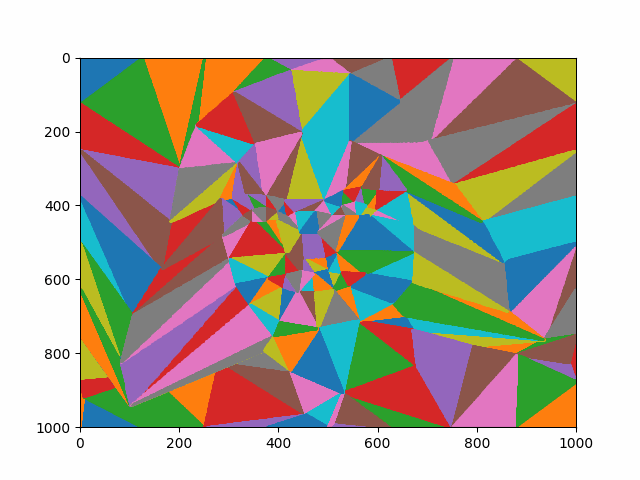

<!--
Applied to each frame of our original actors
Problem: This is continuous. We want discrete pixels colors.
-->

---

## Inverse Color Sampling


<!--
Inverse sampling to avoid gaps in sampling
Bilinear interpolation
-->

---

## Color Sampling Example

<div class="container">

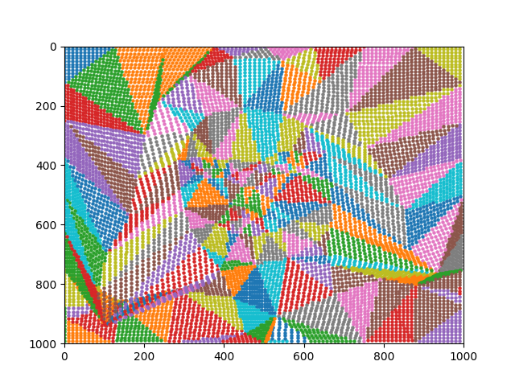
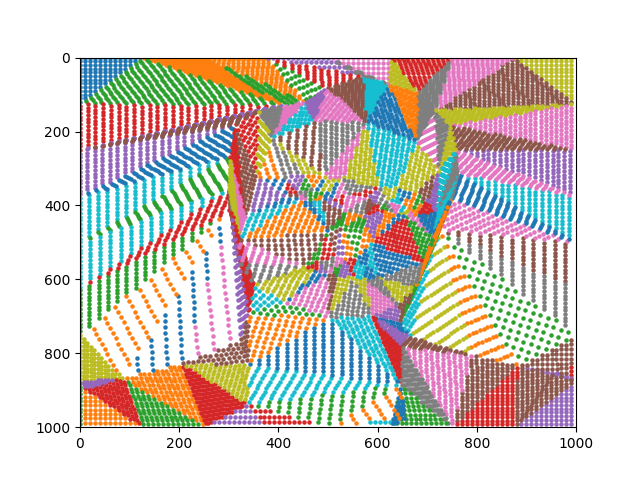

</div>

$\alpha = 0.4$, Check simplex with Barycentric Coordinates

<!--
Barycentric is just (0,0,1) type for each corner
More efficient than other algs?
Do this for each pixel
This is taking a frame at a = 0.4 then seeing where each pixel would sample
Observe big gaps in Muscato
-->

---

## Menzel -> Muscato


<!--
Ear
-->

---

## Brady -> Jesse Eisenberg

<div class="container">

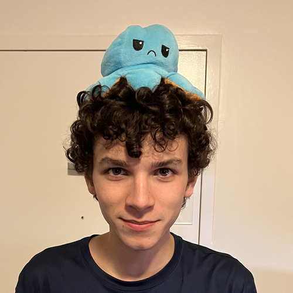
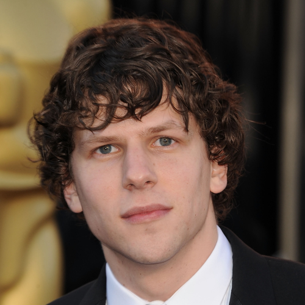


</div>

<!--
Neck
-->

---

## Here kitty kitty kitty kitty kitty kitty kitty kitty

<div class="container">

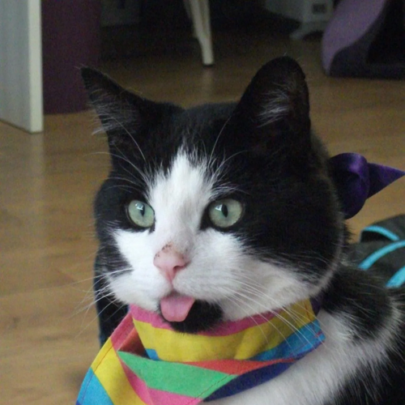
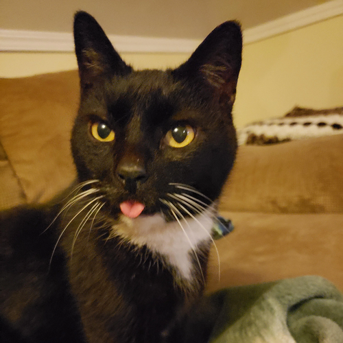
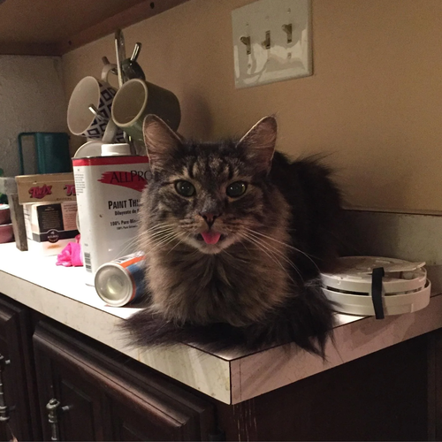
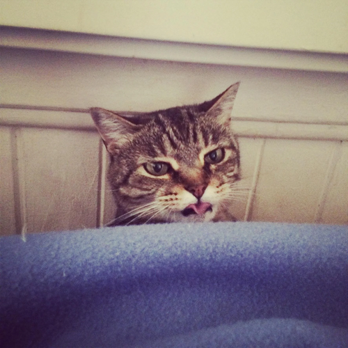
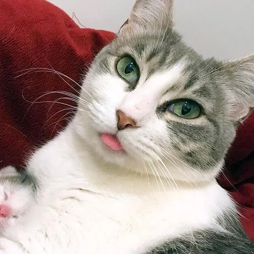

</div>

Source: [r/blep](https://www.reddit.com/r/Blep/top/)

<!--
Diff angles of faces and stuff
Tongue was necessary for anchor
-->

---


(Simple mesh on faces, eyes, and blep only)

---

## Mesh Morphing

---


Only sampling colors from initial source image

<!--
Scary
-->

---

## Flower Transformation

<div class="container">

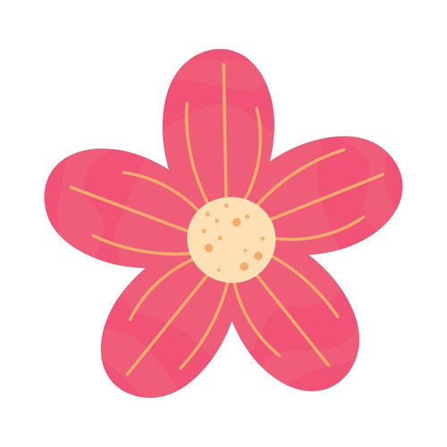


</div>

<!--
Animation Application
Shrinking mesh is smaller, rot mesh is bigger
Nice grooves
-->


---

## Caricature

<div class="container">


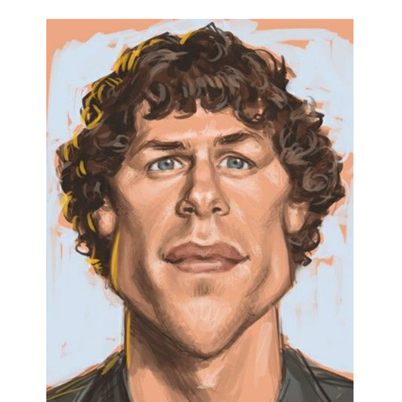
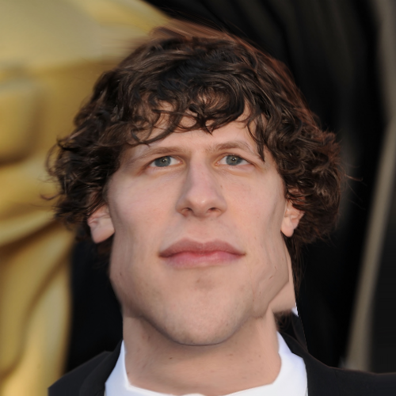

</div>

---

# Demonstration

```
>>> ./morph.py -h
usage: morph.py [-h] [--task {interp_images,interp_meshes,draw_mesh}] [--nframes NFRAMES] [--fname FNAME] src_img dst_img src_mesh dst_mesh

Draw meshes and interpolate images.

positional arguments:
  src_img               Path to image used as source
  dst_img               Path to image used as destination
  src_mesh              Path to mesh corresponding to src_img
  dst_mesh              Path to mesh corresponding to dst_img

options:
  -h, --help            show this help message and exit
  --task {interp_images,interp_meshes,draw_mesh}
                        interp_images: Interpolate between images (default).
                        interp_meshes: Ignore dst_img and sample interpolation from only
                                       src_img, effectively animating the image.
                        draw_mesh: Select points on image to draw mesh, ignores dst_* args.
  --nframes NFRAMES     Number of frames to generate (default: 10)
  --fname FNAME         Name of generated gif and frames (default: 'result')
```

---

### Extensions / Limitations

- Forward sampling could be faster (~10 sec per frame now)
- Delaunay triangulation on average mesh could create slivers
- Selecting points could be done automatically through ML algorithms
- Simpler than other algorithms (Beier-Neely)

<!--
Beier-Neely warps lines matching instead of point meshes matching
-->

---

# Questions?


[https://github.com/ericlovesmath/image-morphing](https://github.com/ericlovesmath/image-morphing)
